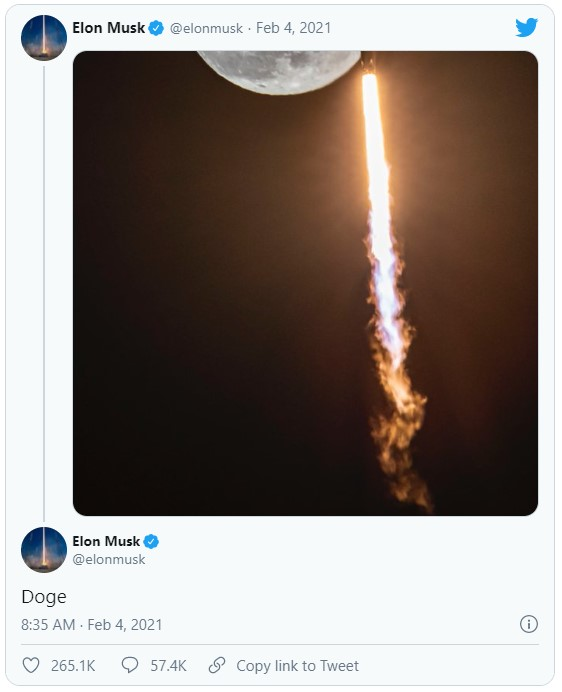

# Doge-Coin-Alert
Doge coin has no intrinsic value, yet this is used by many speculators to realize short term returns in the double digit factor range. Currently (February 2021), the market is overheated. Nevertheless, I would like to be informed when the prices have calmed down again, so that I can buy cheaply and thus profit in the next hype.





To determine a "fair" value, I download the DogeCoin of the past few years

````python
from pandas_datareader import data as pdr
import yfinance as yf
import matplotlib.pyplot as plt

Download = yf.download('DOGE-USD')

#plot
fig, ax1 = plt.subplots(figsize=(20,4.5))
ax1.grid(color='black', linestyle='--', linewidth=0.05)
ax1.title.set_text('Doge USD Price')
ax1.set_xlabel('date')
ax1.set_ylabel('USD')
ax1.plot(Download.index, Download.Close, label='DOGE-Coin')
fig.tight_layout()  # otherwise the right y-label is slightly clipped
plt.savefig("DogeCoinHistory.png", bbox_inches='tight')
````


As can be seen in the figure, there were two overvalued phases. The first in 2017/2018 and the second in early 2021


For this reason, I would like to get the median of the range 2019 and 2020.

```` python
Startdate = "2019-01-01"
Enddate = "2020-12-31"

Download_range = (Download.index > Startdate) & (Download.index <= Enddate)
Median = round(Download.loc[Download_range].Close.median(), 4)
Median
0.0.0026
````

0.0026 is the fair value of DogeCoin that I have chosen. Next I would like to program an alarm in the form of an informing mail as soon as the value drops to this value again. This is a good time to buy Doge and then wait until a new event makes the coin rise again by x times.

For this I use the Binance API to determine current DogeCoin prices. For more info please visit https://www.binance.com/


````python
#!/usr/bin/python
from binance.client import Client
import re
import matplotlib.pyplot as plt
from mpl_finance import candlestick_ohlc
import pandas as pd
import numpy as np
import time # für die aktuelle Zeit
import datetime # für die Datumsumrechnung
from email.mime.text import MIMEText
from email.mime.application import MIMEApplication
from email.mime.multipart import MIMEMultipart
from email.mime.base import MIMEBase
from email import encoders
from smtplib import SMTP
import smtplib
import sys

client = Client("Binance-API Username", "Binance-API Password")

### TIME
UnixTime = int(time.time())
currentdate = datetime.datetime.fromtimestamp(UnixTime).strftime('%Y-%m-%d')

CrashAlert_newrow = ([UnixTime, int(datetime.datetime.fromtimestamp(UnixTime).strftime('%Y')), int(datetime.datetime.fromtimestamp(UnixTime).strftime('%m')), int(datetime.datetime.fromtimestamp(UnixTime).strftime('%d')), int(datetime.datetime.fromtimestamp(UnixTime).strftime('%H' + "00"))])

COINS = ['DOGEUSDT']
for COIN in COINS:
    scraping_ohlc_coin = client.get_klines(symbol=COIN, interval=Client.KLINE_INTERVAL_30MINUTE)
    scraping_ohlc_coin = np.asarray(scraping_ohlc_coin)
    scraping_ohlc_coin = scraping_ohlc_coin[:,:5]
    Index = np.unique([scraping_ohlc_coin[:,0]], return_index=True)
    close = scraping_ohlc_coin[Index[1],:][-1][4]
    CrashAlert_newrow.append(float(close))
    CrashAlert_newrow.append(float(0)) # is needed for the counter whether a hint was already sent, so that one is not spammed

````

The script loads the current DogeCoin rate and saves it in a CSV file. The following data is saved

UNIX Time, Year, Month, Day, Time, DogeCoin price, Triggersignal if a mail was already sent


| UNIX EPOCH | YEAR | MONTH | DAY | HOUR | DogeCoin-Value  | Trigger |
|     :---:      | :---:      | :---:      | :---:      | :---:      | :---:      |  :---:      | 
| 1613484062 | 2021 | 2 | 16 | 1500 | 0.0568 | 0 |
| 1613480463 | 2021 | 2 | 16 | 1400 | 0.0568 | 0 |
| 1613476863 | 2021 | 2 | 16 | 1300 | 0.0578 | 0 |

In order that a mail is not always sent, a trigger signal has been incorporated. The trigger signal is issued when the price falls below the critical value.

````python
if CrashAlert_newrow[-2] < 0.0026:
    CrashAlert_newrow[-1] = 1

path_ = "C:/#########################/DOGE_CrashAlert.csv"

CrashAlert = np.loadtxt(path_, delimiter=",")
CrashAlert = np.flipud(CrashAlert)
CrashAlert = np.vstack([CrashAlert, CrashAlert_newrow])
CrashAlert = np.flipud(CrashAlert)
fmt = '%d', '%d', '%d', '%d','%d', '%1.4f', '%1.0f'
np.savetxt(path_, CrashAlert, delimiter=",", fmt=fmt)
````

Here you have to change your mail address data

````python
if CrashAlert[0,-1] != CrashAlert[1,-1]:
    Name = 'DOGECOIN cheaper than 0.0026 USD: ' + str(CrashAlert_newrow[-2]) +  'USD'
    fromaddr = '########@gmail.com' #Sender email address
    toaddr = '######@gmail.com' # Target email adress
    msg = MIMEMultipart()
    msg['From'] = fromaddr
    msg['To'] = toaddr
    msg['Subject'] = currentdate + ": " + Name
    body = ''
    msg.attach(MIMEText(body, 'plain'))
    server = smtplib.SMTP('smtp.gmail.com', 587)
    server.starttls()
    server.login(fromaddr, '############') # Sender email address password
    text = msg.as_string()
    server.sendmail(fromaddr, toaddr, text)
    server.quit()
````
# Automated query

This script is running on my Raspberry and is executed hourly via crontab
Copy the Python script to your Raspberry, e.g. /home/pi/**/DogeCoinAlert.py

## Run the script automatically every hour

Go on your terminal and enter crontab -e and enter this command

```python
1 * * * * /usr/bin/python3 /home/pi/****/DogeCoinAlert.py
```   
This script will be executed every hour and one minute

---
## Upload your CSV file into your clouad on your raspberry pi
Important: You need to install dropbox on your raspberry pi (cf. https://pimylifeup.com/raspberry-pi-dropbox/)

```python
3 * * * *  /home/pi/Dropbox-Uploader/dropbox_uploader.sh upload /home/pi/*****/DOGE_CrashAlert.csv
```   
This script will be executed every hour and 3 minutes. The time delay is due to the fact that in case the Python script takes longer to retrieve and save the data, the latest data will still be uploaded to the cloud.


# Summary

If you buy the coin for 0.0026 and wait until a future event causes the coin to rise again, you can make very large profits.

The latest maximum was at 0.0788. This is equivalent to a 30-fold increase.
